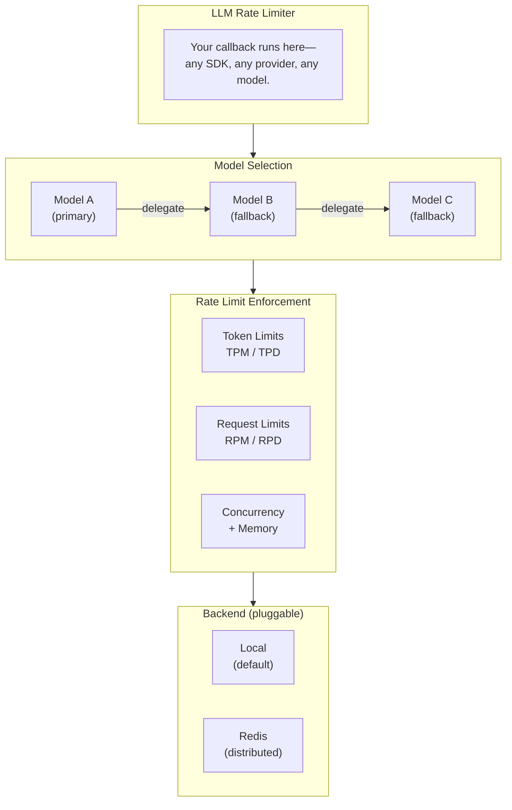
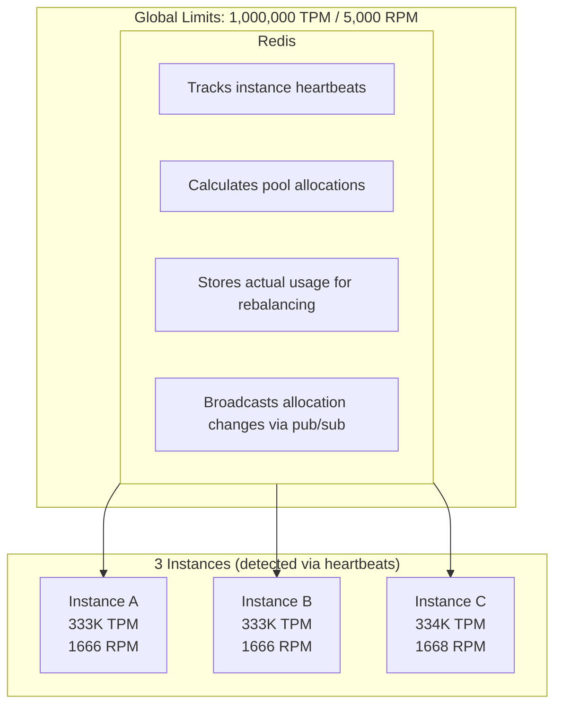

<p align="center">
  <h1 align="center">LLM Rate Limiter</h1>
  <p align="center">
    A TypeScript library for managing LLM API rate limits across multiple models and instances.
  </p>
</p>

<p align="center">
  <a href="https://www.typescriptlang.org/">
    
  </a>
  <a href="https://nodejs.org/">
    
  </a>
  <a href="https://opensource.org/licenses/MIT">
    
  </a>
  <a href="https://redis.io/">
    
  </a>
</p>

<p align="center">
  <a href="#the-problem">Problem</a> •
  <a href="#quickstart">Quickstart</a> •
  <a href="#features">Features</a> •
  <a href="#distributed-mode">Distributed Mode</a> •
  <a href="#api-reference">API Reference</a>
</p>

---

## The Problem

LLM APIs enforce multiple overlapping rate limits: tokens per minute (TPM), requests per minute (RPM), daily quotas (TPD/RPD), and concurrent request caps. These limits apply globally to your API key, not per instance.

When you scale horizontally, local rate limiting breaks. Three instances each tracking "500 RPM locally" will hit a 500 RPM global limit 3x faster than expected. You need distributed coordination, but most solutions require deploying and maintaining separate proxy infrastructure.

Additionally:

- **Capacity estimation is imprecise.** You reserve 10K tokens for a job, it uses 6K, and that 4K sits locked until the job completes—wasted capacity that could serve other requests.
- **Fallback logic is non-trivial.** When GPT-4 hits its limit, you want to fall back to Claude, but only if Claude has capacity, and you need to track which model actually served the request.
- **Time windows create edge cases.** A job that starts in minute N but completes in minute N+1 shouldn't get tokens refunded to minute N+1's budget—that minute never had those tokens reserved.

This library handles all of this as an in-process solution. No sidecars, no proxies, no infrastructure to deploy. It's a library you import that coordinates via Redis when you need distribution.

## How It Works

The library wraps your LLM calls in a job queue that enforces rate limits before execution. You provide a callback containing your actual LLM code—any SDK, any provider. The library:

1. Checks capacity across all configured limits (TPM, RPM, TPD, RPD, concurrent, memory)
2. Either executes immediately, queues until capacity is available, or delegates to the next model
3. Adjusts capacity counters based on actual token usage after completion
4. Coordinates with other instances via Redis (optional) using pool-based allocation

## Features

| Feature                      | Description                                                             |
| ---------------------------- | ----------------------------------------------------------------------- |
| **Rate Limits**              | RPM, TPM, RPD, TPD, concurrent requests, memory-based limits            |
| **Multi-Model Fallback**     | Automatic delegation to next model when capacity is exhausted           |
| **Distributed Coordination** | Redis backend for multi-instance deployments with pool-based allocation |
| **Cost Tracking**            | Per-request cost calculation with input/output/cached token pricing     |
| **Actual Usage Adjustment**  | Refunds unused capacity when jobs use less than estimated               |
| **Type Safety**              | Full TypeScript support with compile-time model ID validation           |
| **Provider Agnostic**        | Callback-based design works with any LLM SDK or API                     |

## Architecture



---

## Quickstart

```bash
npm install @llm-rate-limiter/core
```

### Basic Usage

```typescript
import { createLLMRateLimiter } from '@llm-rate-limiter/core';

const limiter = createLLMRateLimiter({
  models: {
    'gpt-4o': {
      requestsPerMinute: 500,
      tokensPerMinute: 150000,
      pricing: { input: 0.0025, output: 0.01, cached: 0.00125 },
    },
  },
});

const result = await limiter.queueJob({
  jobId: 'job-123',
  job: async ({ modelId }) => {
    const response = await openai.chat.completions.create({
      model: modelId,
      messages: [{ role: 'user', content: 'Hello' }],
    });
    
    return {
      data: response.choices[0].message.content,
      requestCount: 1,
      inputTokens: response.usage?.prompt_tokens ?? 0,
      outputTokens: response.usage?.completion_tokens ?? 0,
      cachedTokens: 0,
    };
  },
});

console.log(result.data);
```

The `job` callback can contain any code—OpenAI, Anthropic, Ollama, or custom APIs. The library manages capacity; you manage the LLM calls.

### Multi-Model with Job Types

```typescript
import { createLLMRateLimiter } from '@llm-rate-limiter/core';

const limiter = createLLMRateLimiter({
  models: {
    'openai/gpt-4o': {
      requestsPerMinute: 500,
      tokensPerMinute: 500000,
      pricing: { input: 0.0025, output: 0.01, cached: 0.00125 },
    },
    'anthropic/claude-3-5-sonnet': {
      requestsPerMinute: 1000,
      tokensPerMinute: 80000,
      pricing: { input: 0.003, output: 0.015, cached: 0.0015 },
    },
    'deepinfra/llama-3-70b': {
      maxConcurrentRequests: 200,  // No TPM/RPM, just concurrency
      pricing: { input: 0.0003, output: 0.0004, cached: 0.0003 },
    },
  },
  escalationOrder: ['openai/gpt-4o', 'anthropic/claude-3-5-sonnet', 'deepinfra/llama-3-70b'],
  resourceEstimationsPerJob: {
    summarize: {
      estimatedUsedTokens: 10000,
      estimatedNumberOfRequests: 1,
      ratio: { initialValue: 0.3 },
    },
    chat: {
      estimatedUsedTokens: 2000,
      estimatedNumberOfRequests: 3,
      ratio: { initialValue: 0.4, flexible: false },  // Protected capacity
    },
    embedding: {
      estimatedUsedTokens: 500,
      estimatedNumberOfRequests: 1,
    },
  },
});

// Jobs are routed based on type and available capacity
const summary = await limiter.queueJob({
  jobId: 'sum-1',
  jobType: 'summarize',
  job: async ({ modelId }) => {
    const response = await callLLM(modelId, longDocument);
    return {
      data: response.text,
      inputTokens: response.usage.input,
      outputTokens: response.usage.output,
      cachedTokens: 0,
      requestCount: 1,
    };
  },
});

console.log(`Model used: ${summary.modelUsed}`);
```

### Distributed (Redis)

For multi-instance deployments:

```bash
npm install @llm-rate-limiter/redis
```

```typescript
import { createLLMRateLimiter } from '@llm-rate-limiter/core';
import { createRedisBackend } from '@llm-rate-limiter/redis';

const limiter = createLLMRateLimiter({
  models: {
    'gpt-4o': {
      requestsPerMinute: 5000,
      tokensPerMinute: 1000000,
      pricing: { input: 0.0025, output: 0.01, cached: 0.00125 },
    },
  },
  backend: createRedisBackend({
    redis: { host: 'localhost', port: 6379 },
    instanceId: process.env.INSTANCE_ID,
    heartbeatIntervalMs: 5000,
    staleInstanceThresholdMs: 15000,
  }),
});

await limiter.start();  // Required for distributed backend
```

---

## Distributed Mode

When running multiple instances, each needs a fair share of your global rate limits. The Redis backend handles this automatically.

### Pool-Based Allocation



Each instance enforces limits against its local pool. Job type ratios (how much of the pool goes to "summarize" vs "chat" jobs) are managed locally per instance—Redis doesn't need to know about job types. This separation allows instant local ratio adjustments without coordination overhead.

### Key Features

| Feature                    | Description                                                  |
| -------------------------- | ------------------------------------------------------------ |
| **Fair Division**          | Slots distributed evenly across active instances             |
| **Heartbeat**              | Automatic cleanup of stale instances                         |
| **Pub/Sub**                | Real-time allocation updates via Redis channels              |
| **Actual Usage Tracking**  | Global counters adjust allocations based on real consumption |
| **Local Ratio Management** | Each instance optimizes job type distribution independently  |

## Actual Usage Adjustment

Most rate limiters reserve capacity based on estimates and never reconcile. If you estimate 10K tokens but use 6K, that 4K is wasted until the time window resets.

This library tracks actual usage and adjusts accordingly:

```
Job starts at 10:00:45 → reserves 10,000 tokens (estimated)
Job completes at 10:00:52 → used 6,000 tokens (actual)
Same minute window → 4,000 tokens refunded to available capacity
```

The adjustment only happens if the job completes within the same time window it started. A job that starts in minute 10 but finishes in minute 11 doesn't get a refund—minute 10's window already closed, and minute 11 never had those tokens reserved.

```typescript
return {
  data: response,
  inputTokens: response.usage.input,   // Actual usage
  outputTokens: response.usage.output,
};
```

If actual usage exceeds the estimate, the overage is added to counters (accurate tracking) and the `onOverage` callback fires (so you can tune estimates).

### Error Handling

When a job throws without calling `reject()`, the library **does not release time-windowed capacity**. It can't know if your code called the LLM API before crashing. This is safe by default—capacity naturally recovers when the time window resets.

If you know the actual usage at the point of failure, call `reject()` explicitly:

```typescript
job: async ({ modelId }, reject) => {
  try {
    const response = await callLLM(modelId);
    // ... processing fails here
  } catch (error) {
    reject(
      { requestCount: 1, inputTokens: 3000, outputTokens: 0, cachedTokens: 0 },
      { delegate: true }  // Try next model
    );
    throw error;
  }
}
```

## Memory-Based Limits

```typescript
const limiter = createLLMRateLimiter({
  models: { /* ... */ },
  memory: {
    totalAvailableMemoryKB: 512 * 1024,
    recalculationIntervalMs: 5000,
  },
  minCapacity: 5,
  maxCapacity: 100,
});
```

## Callbacks

```typescript
const limiter = createLLMRateLimiter({
  models: { /* ... */ },
  onAvailableSlotsChange: (availability, reason) => {
    // reason: 'tokensMinute' | 'tokensDay' | 'requestsMinute' | 
    //         'requestsDay' | 'concurrentRequests' | 'memory' | 'distributed'
  },
  onOverage: (overage) => {
    console.warn(`Exceeded estimate by ${overage.tokens} tokens`);
  },
  onLog: (level, message, data) => {
    // 'debug' | 'info' | 'warn' | 'error'
  },
});
```

---

## API Reference

### `createLLMRateLimiter(config)`

```typescript
interface LLMRateLimiterConfig {
  models: Record<string, ModelRateLimitConfig>;
  escalationOrder?: string[];
  resourceEstimationsPerJob?: Record<string, JobTypeConfig>;
  backend?: BackendConfig;
  memory?: MemoryConfig;
  minCapacity?: number;
  maxCapacity?: number;
  onAvailableSlotsChange?: OnAvailableSlotsChange;
  onOverage?: OnOverage;
  onLog?: LogFn;
}

interface ModelRateLimitConfig {
  requestsPerMinute?: number;
  requestsPerDay?: number;
  tokensPerMinute?: number;
  tokensPerDay?: number;
  maxConcurrentRequests?: number;
  pricing: { input: number; cached: number; output: number };
}

interface JobTypeConfig {
  estimatedUsedTokens?: number;
  estimatedUsedMemoryKB?: number;
  estimatedNumberOfRequests?: number;
  ratio?: { initialValue: number; flexible?: boolean };
  maxWaitMS?: Record<string, number>;
}
```

### `limiter.queueJob(options)`

```typescript
interface QueueJobOptions<T> {
  jobId: string;
  jobType?: string;
  job: (args: { modelId: string }, reject: RejectFn) => Promise<JobResult<T>>;
  onComplete?: (result: T, context: JobContext) => void;
  onError?: (error: Error, context: JobContext) => void;
}

interface JobResult<T> {
  data: T;
  requestCount?: number;
  inputTokens: number;
  outputTokens: number;
  cachedTokens: number;
}
```

### Other Methods

```typescript
limiter.hasCapacity(): boolean
limiter.hasCapacityForModel(modelId: string): boolean
limiter.getStats(): Stats
limiter.getModelStats(modelId: string): ModelStats
limiter.start(): Promise<void>  // Required for distributed backend
limiter.stop(): Promise<void>
```

## Project Structure

```
llm-rate-limiter/
├── packages/
│   ├── core/           # Core rate limiter
│   ├── redis/          # Redis distributed backend
│   └── e2e/            # End-to-end tests
├── docs/               # Design documents
└── README.md
```

## Contributing

Contributions are welcome! Please:

1. Fork the repository
2. Create a feature branch (`git checkout -b feature/amazing-feature`)
3. Write tests for your changes
4. Ensure all tests pass (`npm test`)
5. Ensure types check (`npm run typecheck`)
6. Commit with a clear message
7. Open a Pull Request

## Development

```bash
git clone https://github.com/llm-rate-limiter/llm-rate-limiter.git
cd llm-rate-limiter
npm install

npm run build          # Build all packages
npm test               # Run tests
npm run typecheck      # Type check
npm run lint           # Lint
```

## License

MIT License - see [LICENSE](LICENSE) for details.

---

<p align="center">
  Built with TypeScript • Provider Agnostic • Distributed coordination via Redis
</p>